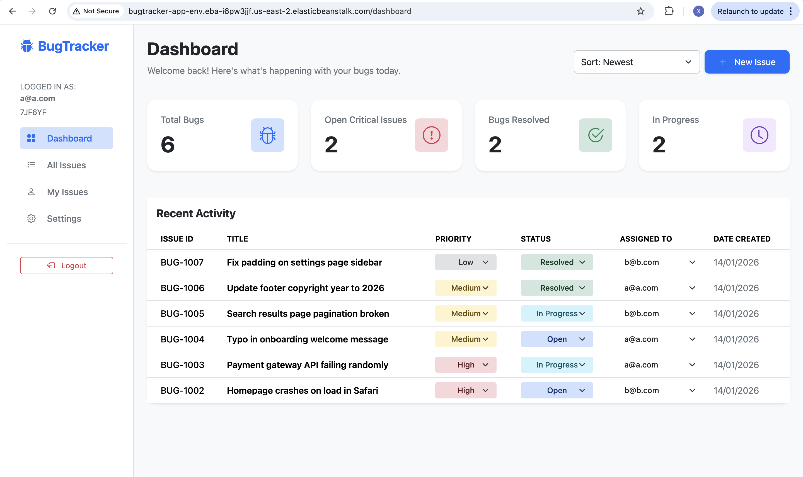

# 🐞 Bug Tracker

A full-stack web application designed for software teams to track, manage, and resolve bugs efficiently. Features secure authentication, team management with invite codes, and a real-time dashboard.

**[🚀 View Live Demo on AWS](http://bugtracker-app-env.eba-i6pw3jjf.us-east-2.elasticbeanstalk.com/login))**

---

## 📸 Screenshots

---

## ✨ Key Features

* **🔐 Secure Authentication:** User registration and login using **JWT (JSON Web Tokens)** and **bcrypt** encryption.
* **👥 Team Management:**
    * **Create a Team:** Automatically generates a unique 6-character **Join Code**.
    * **Join a Team:** Users can join existing teams using the secure code.
* **📊 Dashboard:** View bugs, assign tasks, and track status (Open, In Progress, Closed).
* **📱 Responsive Design:** Built with Bootstrap for a clean UI on any device.

---

## 🛠️ Tech Stack

**Frontend:**
* React (Vite)
* TypeScript
* Bootstrap & Bootstrap Icons
* Axios

**Backend:**
* Node.js & Express
* MySQL (Database)
* JSON Web Token (JWT)
* BcryptJS

---

## 👥 Authors
Xin Chen - Full Stack Developer

Ruichen Song - Full Stack Developer
